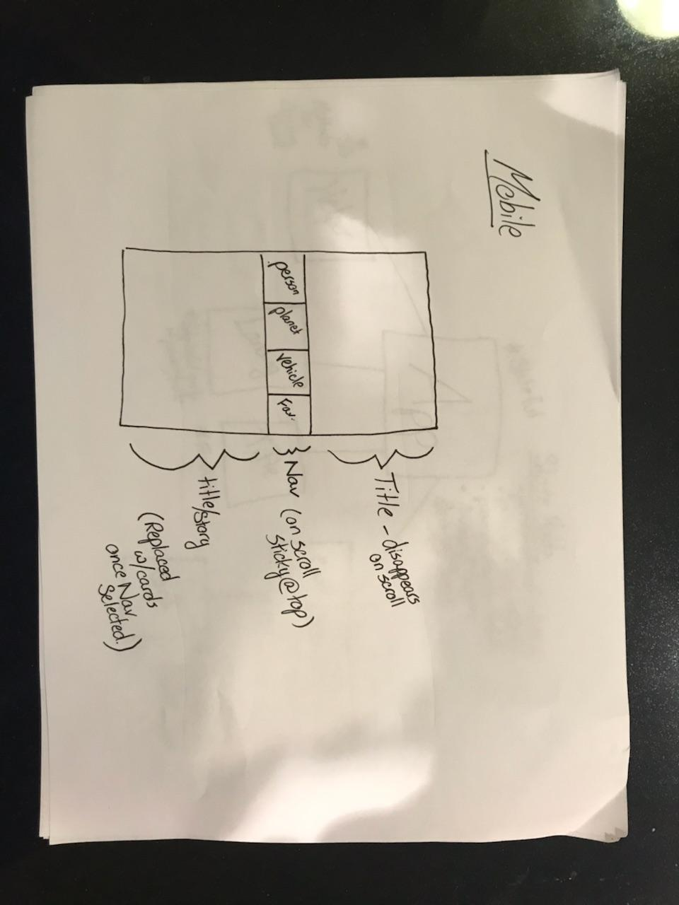
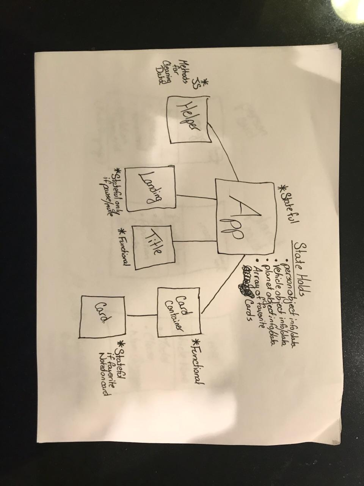
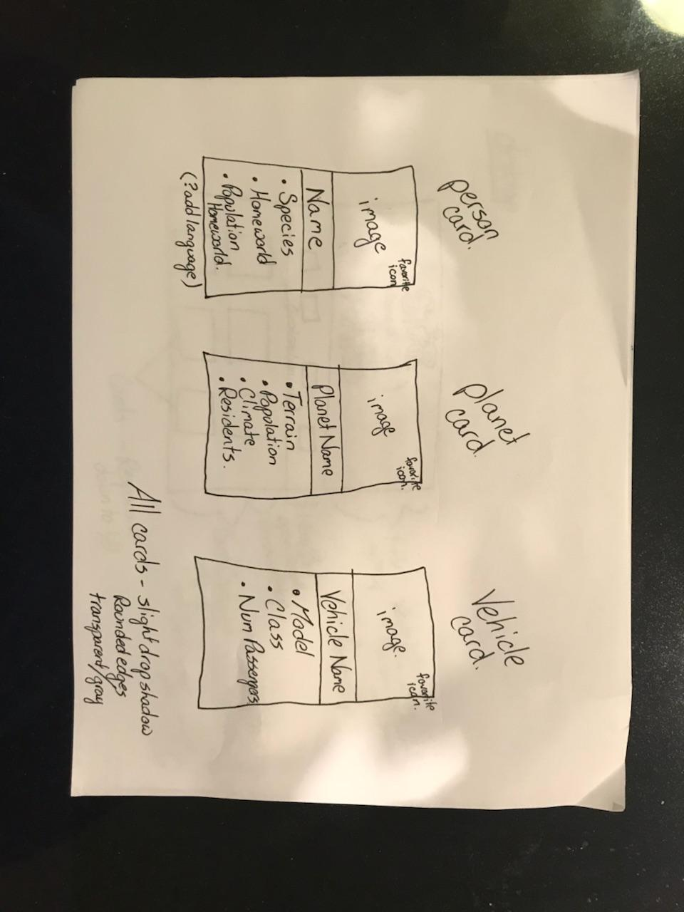
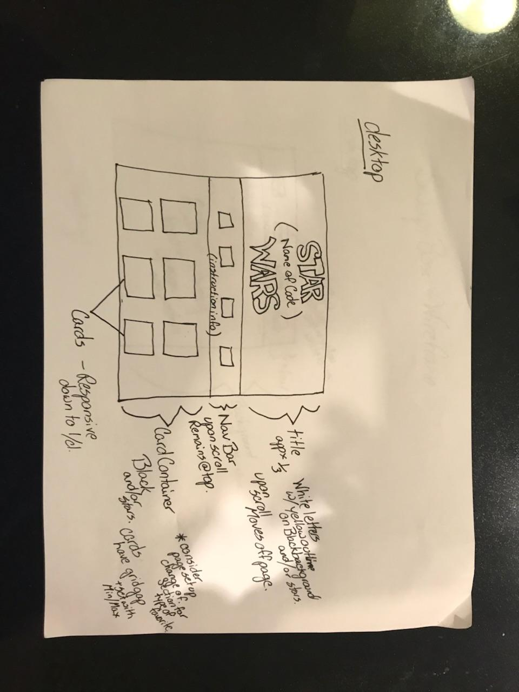
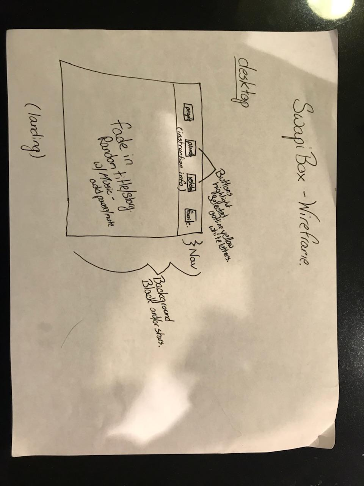

SWAPI Box is project where we are drawing information from the Star Wars API and rendering information to cards based on the return data.

We utilized React Router for page navigation.

This project was bootstrapped with [Create React App](https://github.com/facebook/create-react-app).

In order to run this project, follow these steps:

1. Clone the repo onto your local machine.
2. npm install
3. npm start

This project was built in collaboration between Aaron Weissman (@aweissman11) and Sara Ebbers (@saraebbers).

Wireframes:

